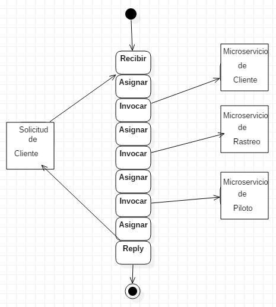

# SA_Tarea4
## BPEL
Está diseñado para orquestar procesos de forma automática, 
se encarga de consumir varios servicios en un orden específico,
que es para lo que fue utilizado en este Sistema

## Sistema
1. Microservicio del Cliente
2. Microservicio del Piloto
3. Microservicio de Rastreo
Estos fueron creados con Web Services en Java.
4. SOA_BPEL (BPEL MODULE)
5. Aplicacion1 (BPEL COMPOSITE APPLICATION)

El orden indicado, para consumir estos servicios fue el siguiente:

Donde:
* La solicitud del cliente es solicitar un Piloto, enviando su Nombre
* Se asigna su nombre al getId del servicio Cliente, 
* Se invoca el servicio de Cliente getId, este devuelve el id del cliente
* Se asignar al parametro de Rastreo el id del Cliente
* Se invoca el servicio de Rastreo rastrearCliente
* Este rastrea al cliente y devuelve el id de un piloto cercano al cliente
* Se envía el id del piloto al servicio del Piloto para obtener su información
* Finalmente se envía dicha información del Piloto al cliente.

## Herramienta de Software Utilizada
* OpenESB 3.1.2

## Video 
https://youtu.be/PErHdPLnsUY
